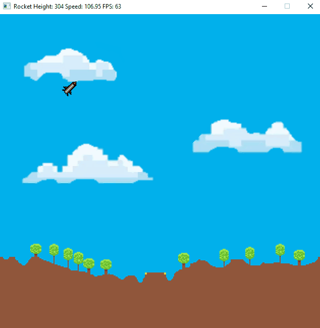

# RocketLanding - Capstone
SDL2 Game written in C++

This project was made to finish the UDACITY NANODEGREE programm: "C++".

## Instructions
* Use the keyboard arrow keys to control the rocket
* Land the rocket slow and and untilted on the horizontal stage
* Press R to restart after landing

## Dependencies for Running Locally
* cmake >= 3.7
  * All OSes: [click here for installation instructions](https://cmake.org/install/)
* make >= 4.1 (Linux, Mac), 3.81 (Windows)
  * Linux: make is installed by default on most Linux distros
  * Mac: [install Xcode command line tools to get make](https://developer.apple.com/xcode/features/)
  * Windows: [Click here for installation instructions](http://gnuwin32.sourceforge.net/packages/make.htm)
* SDL2       >= 2.0
* SDL2_image >= 2.0
  * All installation instructions can be found [here](https://wiki.libsdl.org/Installation)
  >Note that for Linux, an `apt` or `apt-get` installation is preferred to building from source. 
* gcc/g++ >= 5.4
  * Linux: gcc / g++ is installed by default on most Linux distros
  * Mac: same deal as make - [install Xcode command line tools](https://developer.apple.com/xcode/features/)
  * Windows: recommend using [MinGW](http://www.mingw.org/)

## Basic Build Instructions

1. Clone this repo.
2. Make a build directory in the top level directory: `mkdir build && cd build`
3. Compile: `cmake .. && make`
4. Copy resource folder "res" to build folder 
5. Run it: `./RocketLanding`.

## Rubric Points
* README
  * A README with instructions is included with the project.
  * The README indicates which project is chosen.
  * The README includes information about each rubric point addressed.  
* Compiling and Testing
  * The submission must compile and run.
* Loops, Functions, I/O
  * The project demonstrates an understanding of C++ functions and control structures.
  * The project accepts user input and processes the input.
* Object Oriented Programming
  * The project uses Object Oriented Programming techniques.
  * Classes use appropriate access specifiers for class members.
  * Class constructors utilize member initialization lists.
  * Classes encapsulate behavior.
  * Classes follow an appropriate inheritance hierarchy.
* Memory Management
  * The project makes use of references in function declarations.
  * The project uses destructors appropriately.
